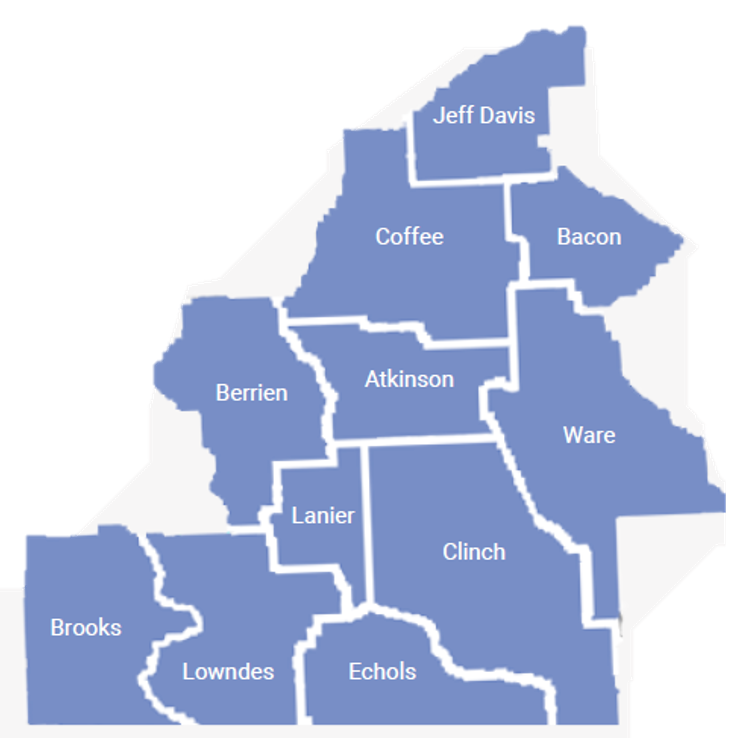

```{r setup, include=FALSE}
knitr::opts_chunk$set(echo = FALSE, 
                      message = FALSE, 
                      warning = FALSE,
                      comment = NA)
```

```{r load libraries, include=FALSE}
library(tidyverse)
library(scales)
library(readxl)
library(ggthemes)
library(gt)
library(gtExtras)
library(bookdown)
library(kableExtra)
library(qualtRics)
```

```{r load and clean data, include=FALSE}
data <- read_survey("qualtrics-data.csv")
```

# Executive Summary

Michael Smith (President & CEO of the Greater Valdosta United Way [GVUW]) submitted a draft plan or request for a Needs Assessment Survey to Darrell Moore (Valdosta State University’s [VSU] Director of the South Georgia Center for Regional Impact) in December 2022. Darrell then contacted Drs. Keith Lee and Joseph Robbins (both at VSU) to secure their assistance in designing and analyzing a Needs Assessment survey targeting residents from 11 counties in South Georgia (i.e., Atkinson, Bacon, Berrien, Brooks, Clinch, Coffee, Echols, Jeff Davis, Lanier, Lowndes, and Ware County). Smith explained that his goal for this project was to better understand how the economic and COVID-19 strains have impacted residents in these counties, assess the mental and psychological needs of these residents, and then to identify the nonprofit services being used (or needed) in the GVUW’s service region. The survey was designed and then launched in January 2023 and concluded at the end of April 2023. All told, 1,300 survey responses were received during the survey period thanks to the help of numerous nonprofit organizations, who were instrumental in spreading the word. The rest of this report outlines our survey methodology and subsequent analysis.

# Survey Methodology

The Needs Assessment survey was conducted via VSU’s Qualtrics license and the actual questionnaire included questions on respondent background, what stressors they currently face (mental health, financial, housing, employment, transportation, internet), what nonprofit services they use (or need). Questions on respondents’ emotional and psychological well-being were included as well.

## Selecting the Survey Method

The survey was accessed via a QR code that directed respondents to a Qualtrics-administered survey. These QR codes were available on widely distributed flyers throughout the 11-county target region.

## Developing a Questionnare

The survey questionnaire was designed through consultations between Michael Smith (President & CEO), Susan Nebel (Community Impact Director), Dr. Keith Lee (VSU), and Dr. Joseph Robbins (VSU). The basis for the survey was to identify the general needs of this region and, in particular, the mental health needs and support among South Georgians. We did not collect personally identifying information among respondents as this was unnecessary for the study and as this was part of the IRB compliance process for this project. 

## Selecting the Sample

The universe of the survey is the 11-county service region listed in Figure 1. All residents in these counties were invited and eligible to participate in the survey. Survey responses were unequally distributed throughout this region, however. Combined, these counties are home to around 287,000 residents.[^1]

[^1]: Figures based on recent U.S. Census Bureau estimates.

```{r survey, out.width = '75%', fig.align='center',fig.cap='Survey Map Insert'}

```

## Conducting the Survey

The survey was publicized in various ways: through GVUW, through GVUW’s  nonprofit partner agencies throughout the 11-county region, by promoting the project through news stories shared by VSU (April 2023) and WALB (February 2023), and by sharing the survey in other various ways. 

## Determining the Results

The results of the Needs Assessment survey have been analyzed in partnership with the stated needs expressed in discussions with the GVUW.


# Survey Results

## Which county do you live in? 

```{r}
county_plot <- as_tibble(data$county)

county_plot |> 
  filter(!is.na(value)) |> 
  group_by(value) |> 
  count() |> 
  ggplot(aes(x = reorder(value,n), y = n, fill=value)) +
  geom_col() + 
  coord_flip() + 
  labs(x = "",
       y = "") +
  geom_text(aes(label = n,
                hjust = 1.25)) + 
  theme_classic() + 
  theme(legend.position = "none")
```


## What was your household income for 2022?

```{r}
household_income <- as.data.frame(table(data$household_income)) |> # create data frame
  mutate(Percentage = round(Freq / sum(Freq) * 100, 2)) |>
  arrange(desc(Percentage))


hi_table <- household_income |> 
  mutate(Ordered = fct_relevel(Var1, c('Greater than $90,000', 
                                       '$70,001 - $90,000',
                                       '$50,001 - $70,000',
                                       '$30,001 - $50,000',
                                       '$0 - $30,000',
                                       'Prefer not to answer')))  |> 
  arrange(Ordered) |> 
  gt() |> 
  cols_label(
    Var1 = "Response",
    Freq = "Count") |>
  cols_align(
    align = "left",
    columns = Var1
  ) |> 
  cols_hide(Ordered) 

hi_table
```

## Do you live in a single parent household?

```{r}
single_parent <- as.data.frame(table(data$single_parent)) |> # create data frame
  mutate(Percentage = round(Freq / sum(Freq) * 100, 2)) |>
  arrange(desc(Percentage))


sp_table <- single_parent |> 
  gt() |>
  cols_label(
    Var1 = "Response",
    Freq = "Count") |>
  cols_align(
    align = "left",
    columns = Var1
  ) # add additional cols_align if need to align additional columns

sp_table
```

## What is your current occupation?

```{r}
occupation_table <- as_tibble(unlist(strsplit(data$occupation,",")))

occupation_table |> 
  filter(!is.na(value),
         value != "Other (please specify)") |> # learn how to remove the space here
  group_by(value) |> 
  count() |> 
  ggplot(aes(x = reorder(value,n), y = n, fill=value)) +
  geom_col() + 
  coord_flip() + 
  labs(x = "",
       y = "") +
  geom_text(aes(label = n,
                hjust = 1.25)) + 
  theme_classic() + 
  theme(legend.position = "none")
```


## Which option best describes your current housing situation?

```{r}
housing <- as.data.frame(table(data$housing)) |> # create data frame
  filter(Var1 != "Other (please specify)") |> 
  mutate(Percentage = round(Freq / sum(Freq) * 100, 2)) |>
  arrange(desc(Percentage))


housing_table <- housing |> 
  gt() |>
  cols_label(
    Var1 = "Response",
    Freq = "Count") |>
  cols_align(
    align = "left",
    columns = Var1
  ) # add additional cols_align if need to align additional columns

housing_table
```


## How often, if at all, is there enough food in your household to feed all household members?

```{r}
food <- as.data.frame(table(data$food)) |> # create data frame
  mutate(Percentage = round(Freq / sum(Freq) * 100, 2)) 


food_table <- food |> 
  mutate(Ordered = fct_relevel(Var1, c('All of the time', 
                                       'Most of the time',
                                       'Some of the time',
                                       'Rarely',
                                       'Never'))) |> 
  arrange(Ordered) |>   
  gt() |>
  cols_label(
    Var1 = "Response",
    Freq = "Count") |>
  cols_align(
    align = "left",
    columns = Var1
  ) |> 
  cols_hide(Ordered) 

  

food_table
```


## Select the option that best describes how stressful each are for you currently.

### Housing costs (e.g., rent, mortgage)

```{r}
housing_stress <- as.data.frame(table(data$housing_stress)) |> 
  mutate(Percentage = round(Freq / sum(Freq) * 100,2 )) 

hs_table <- housing_stress |> 
  mutate(Ordered = fct_relevel(Var1, c("Very stressful",
                                       "Somewhat stressful",
                                       "Not stressful",
                                       "Not applicable, do not have to pay for this")
                               )
         ) |> 
  arrange(Ordered) |> 
  gt() |> 
  cols_label(
    Var1 = "Response",
    Freq = "Count") |>
  cols_align(
    align = "left",
    columns = Var1
  ) |> 
  cols_hide(Ordered) 
hs_table
```


### Home energy costs (electricity, natural gas, propane) costs

```{r}
energy_stress <- as.data.frame(table(data$energy_stress)) |> 
  mutate(Percentage = round(Freq / sum(Freq) * 100,2 )) 

es_table <- energy_stress |> 
  mutate(Ordered = fct_relevel(Var1, c("Very stressful",
                                       "Somewhat stressful",
                                       "Not stressful",
                                       "Not applicable, do not have to pay for this")
  )
  ) |> 
  arrange(Ordered) |> 
  gt() |> 
  cols_label(
    Var1 = "Response",
    Freq = "Count") |>
  cols_align(
    align = "left",
    columns = Var1
  ) |> 
  cols_hide(Ordered) 
es_table
```

### Food costs

```{r}
food_stress <- as.data.frame(table(data$food_stress)) |> 
  mutate(Percentage = round(Freq / sum(Freq) * 100,2 )) 

fs_table <- food_stress |> 
  mutate(Ordered = fct_relevel(Var1, c("Very stressful",
                                       "Somewhat stressful",
                                       "Not stressful",
                                       "Not applicable, do not have to pay for this")
  )
  ) |> 
  arrange(Ordered) |> 
  gt() |> 
  cols_label(
    Var1 = "Response",
    Freq = "Count") |>
  cols_align(
    align = "left",
    columns = Var1
  ) |> 
  cols_hide(Ordered) 
fs_table
```


### Access to reliable transportation

```{r}
trans_stress <- as.data.frame(table(data$trans_stress)) |> 
  mutate(Percentage = round(Freq / sum(Freq) * 100,2 )) 

ts_table <- trans_stress |> 
  mutate(Ordered = fct_relevel(Var1, c("Very stressful",
                                       "Somewhat stressful",
                                       "Not stressful",
                                       "Not applicable, do not have to pay for this")
  )
  ) |> 
  arrange(Ordered) |> 
  gt() |> 
  cols_label(
    Var1 = "Response",
    Freq = "Count") |>
  cols_align(
    align = "left",
    columns = Var1
  ) |> 
  cols_hide(Ordered) 
ts_table
```

\newpage

## At home, how reliable is your internet access?

```{r}
internet_access <- as.data.frame(table(data$internet_access)) |> 
  mutate(Percentage = round(Freq / sum(Freq) * 100,2 )) 

ia_table <- internet_access |> 
  mutate(Ordered = fct_relevel(Var1, c("Very reliable",
                                       "Somewhat reliable",
                                       "Not at all reliable",
                                       "Not applicable, I do not have internet access at home")
  )
  ) |> 
  arrange(Ordered) |> 
  gt() |> 
  cols_label(
    Var1 = "Response",
    Freq = "Count") |>
  cols_align(
    align = "left",
    columns = Var1
  ) |> 
  cols_hide(Ordered) 

ia_table
```

## Do you require childcare?

```{r}
child_care <- as.data.frame(table(data$child_care)) |> 
  mutate(Percentage = round(Freq / sum(Freq) * 100,2 )) 

cc_table <- child_care |> 
  mutate(Ordered = fct_relevel(Var1, c("Yes, my child care needs are met",
                                       "Yes, we have additional child care needs",
                                       "Yes, we require child care but do not have it",
                                       "Not applicable, my children are old enough they do not require childcare",
                                       "Not applicable, I do not have children")
                               )
         ) |> 
  arrange(Ordered) |> 
  gt() |> 
  cols_label(
    Var1 = "Response",
    Freq = "Count") |>
  cols_align(
    align = "left",
    columns = Var1
  ) |> 
  cols_hide(Ordered) 

cc_table
```


### If so, which option best describes your child care needs? 

```{r}
child_care_needs <- as.data.frame(table(data$child_care_needs)) |> 
  mutate(Percentage = round(Freq / sum(Freq) * 100,2 )) 

ccn_table <- child_care_needs |> 
  mutate(Ordered = fct_relevel(Var1, c("Full-time child care",
                                       "After-school child care",
                                       "Other (please specify)")
  )
  ) |> 
  arrange(Ordered) |> 
  gt() |> 
  cols_label(
    Var1 = "Response",
    Freq = "Count") |>
  cols_align(
    align = "left",
    columns = Var1
  ) |> 
  cols_hide(Ordered) 

ccn_table
```

\newpage

## Select the option that best describes how stressful each are for you currently.

### Child care costs

```{r}
childcare_stress <- as.data.frame(table(data$child_care_stress)) |> 
  mutate(Percentage = round(Freq / sum(Freq) * 100,2 )) 

ccs_table <- childcare_stress |> 
  mutate(Ordered = fct_relevel(Var1, c("Very stressful",
                                       "Somewhat stressful",
                                       "Not stressful",
                                       "Not applicable, do not have to pay for this")
  )
  ) |> 
  arrange(Ordered) |> 
  gt() |> 
  cols_label(
    Var1 = "Response",
    Freq = "Count") |>
  cols_align(
    align = "left",
    columns = Var1
  ) |> 
  cols_hide(Ordered) 

ccs_table
```


### Clothing costs

```{r}
clothing_stress <- as.data.frame(table(data$clothing_stress)) |> 
  mutate(Percentage = round(Freq / sum(Freq) * 100,2 )) 

cs_table <- clothing_stress |> 
  mutate(Ordered = fct_relevel(Var1, c("Very stressful",
                                       "Somewhat stressful",
                                       "Not stressful",
                                       "Not applicable, do not have to pay for this")
  )
  ) |> 
  arrange(Ordered) |> 
  gt() |> 
  cols_label(
    Var1 = "Response",
    Freq = "Count") |>
  cols_align(
    align = "left",
    columns = Var1
  ) |> 
  cols_hide(Ordered) 

cs_table
```

\newpage

## Since January of 2020 which, if any, support services did you access?

```{r}
services_table <- as_tibble(unlist(strsplit(data$services,",")))

services_table |> 
  filter(!is.na(value),
         value != "Other (please specify)") |> # learn how to remove the space here
  group_by(value) |> 
  count() |> 
  ggplot(aes(x = reorder(value,n), y = n, fill=value)) +
  geom_col() + 
  coord_flip() + 
  labs(x = "",
       y = "") +
  geom_text(aes(label = n,
                hjust = 1.25)) + 
  theme_classic() + 
  theme(legend.position = "none")
```

### Which organization(s) provided these services? 

```{r}
org_table <- as_tibble(unlist(strsplit(data$organizations,",")))

org_table |> 
  filter(!is.na(value),
         value != "Other (please specify)") |> # learn how to remove the space here
  group_by(value) |> 
  count() |> 
  ggplot(aes(x = reorder(value,n), y = n, fill=value)) +
  geom_col() + 
  coord_flip() + 
  labs(x = "",
       y = "") +
  geom_text(aes(label = n,
                hjust = 1.25)) + 
  theme_classic() + 
  theme(legend.position = "none")
```


## Since January of 2020 which, if any, support resources did you need but could not access? 

```{r}
rna_table <- as_tibble(unlist(strsplit(data$resources_non_access,",")))

rna_table |> 
  filter(!is.na(value),
         value != "None",
         value != "Other (please specify)",
         value != " I was able to access all the resources I needed") |> # learn how to remove the space here
  group_by(value) |> 
  count() |> 
  ggplot(aes(x = reorder(value,n), y = n, fill=value)) +
  geom_col() + 
  coord_flip() + 
  labs(x = "",
       y = "") +
  geom_text(aes(label = n,
                hjust = 1.25)) + 
  theme_classic() + 
  theme(legend.position = "none")
```

### If you were unable to access resources, why could you not access them? 

```{r}
wna_table <- as_tibble(unlist(strsplit(data$why_non_access,",")))

wna_table |> 
  filter(!is.na(value),
         value != "Other (please specify)") |> 
  group_by(value) |> 
  count() |> 
  ggplot(aes(x = reorder(value,n), y = n, fill=value)) +
  geom_col() + 
  coord_flip() + 
  labs(x = "",
       y = "") +
  geom_text(aes(label = n,
                hjust = 1.25)) + 
  theme_classic() + 
  theme(legend.position = "none")
```

\newpage

## Please rate how you have felt since January of 2022 on each of the following areas.

### I felt happy.

```{r}
happy_table <- as.data.frame(table(data$happy)) |>  # create data frame 
  mutate(Percentage = round(Freq / sum(Freq) * 100, 2)) |> 
  arrange(desc(Percentage)) |> 
  mutate(Ordered = fct_relevel(Var1, c('Nearly always', 
                                       'Most of the time',
                                       'Some of the time',
                                       'Rarely'))) |> 
  arrange(Ordered) |> 
  gt() |> 
  cols_label(
    Var1 = "Response",
    Freq = "Count") |>
  cols_align(
    align = "left",
    columns = Var1
  ) |> 
  cols_hide(Ordered) 

happy_table
```


### I felt sad.

```{r}
sad <- as.data.frame(table(data$sad)) |> # create data frame
  mutate(Percentage = round(Freq / sum(Freq) * 100, 2)) |>
  arrange(desc(Percentage))


sad_table <- sad |> 
  mutate(Ordered = fct_relevel(Var1, c('Nearly always', 
                                       'Most of the time',
                                       'Some of the time',
                                       'Rarely'))) |> 
  arrange(Ordered) |> 
  gt() |> 
  cols_label(
    Var1 = "Response",
    Freq = "Count") |> 
  cols_align(
    align = "left",
    columns = Var1
  ) |> 
  cols_hide(Ordered) 

sad_table
```


### I felt stressed.

```{r}
stressed <- as.data.frame(table(data$stressed)) |> # create data frame
  mutate(Percentage = round(Freq / sum(Freq) * 100, 2)) |>
  arrange(desc(Percentage))


stressed_table <- stressed |> 
  mutate(Ordered = fct_relevel(Var1, c('Nearly always', 
                                       'Most of the time',
                                       'Some of the time',
                                       'Rarely'))) |> 
  arrange(Ordered) |> 
  gt() |> 
  cols_label(
    Var1 = "Response",
    Freq = "Count") |>
  cols_align(
    align = "left",
    columns = Var1
  ) |> 
  cols_hide(Ordered) 

stressed_table

```

### I felt angry.

```{r}
angry <- as.data.frame(table(data$angry)) |> # create data frame
  mutate(Percentage = round(Freq / sum(Freq) * 100, 2)) |>
  arrange(desc(Percentage))


angry_table <- angry |> 
  mutate(Ordered = fct_relevel(Var1, c('Nearly always', 
                                       'Most of the time',
                                       'Some of the time',
                                       'Rarely'))) |> 
  arrange(Ordered) |> 
  gt() |> 
  cols_label(
    Var1 = "Response",
    Freq = "Count") |>
  cols_align(
    align = "left",
    columns = Var1
  ) |> 
  cols_hide(Ordered) 

angry_table
```

\newpage

### I felt frustrated.

```{r}
frustrated <- as.data.frame(table(data$frustrated)) |> # create data frame
  mutate(Percentage = round(Freq / sum(Freq) * 100, 2)) |>
  arrange(desc(Percentage))


frustrated_table <- frustrated |> 
  mutate(Ordered = fct_relevel(Var1, c('Nearly always', 
                                       'Most of the time',
                                       'Some of the time',
                                       'Rarely'))) |> 
  arrange(Ordered) |> 
  gt() |> 
  cols_label(
    Var1 = "Response",
    Freq = "Count") |>
  cols_align(
    align = "left",
    columns = Var1
  ) |> 
  cols_hide(Ordered) 

frustrated_table
```


### I felt tired.

```{r}
tired <- as.data.frame(table(data$tired)) |> # create data frame
  mutate(Percentage = round(Freq / sum(Freq) * 100, 2)) |>
  arrange(desc(Percentage))


tired_table <- tired |> 
  mutate(Ordered = fct_relevel(Var1, c('Nearly always', 
                                       'Most of the time',
                                       'Some of the time',
                                       'Rarely'))) |> 
  arrange(Ordered) |> 
  gt() |> 
  cols_label(
    Var1 = "Response",
    Freq = "Count") |>
  cols_align(
    align = "left",
    columns = Var1
  ) |> 
  cols_hide(Ordered) 

tired_table
```


### I felt hopeful.

```{r}
hopeful <- as.data.frame(table(data$hopeful)) |> # create data frame
  mutate(Percentage = round(Freq / sum(Freq) * 100, 2)) |>
  arrange(desc(Percentage))


hopeful_table <- hopeful |> 
  mutate(Ordered = fct_relevel(Var1, c('Nearly always', 
                                       'Most of the time',
                                       'Some of the time',
                                       'Rarely'))) |> 
  arrange(Ordered) |> 
  gt() |> 
  cols_label(
    Var1 = "Response",
    Freq = "Count") |>
  cols_align(
    align = "left",
    columns = Var1
  ) |> 
  cols_hide(Ordered)

hopeful_table

```

### I felt worried.

```{r}
worried <- as.data.frame(table(data$worried)) |> # create data frame
  mutate(Percentage = round(Freq / sum(Freq) * 100, 2)) |>
  arrange(desc(Percentage))


worried_table <- worried |> 
  mutate(Ordered = fct_relevel(Var1, c('Nearly always', 
                                       'Most of the time',
                                       'Some of the time',
                                       'Rarely'))) |> 
  arrange(Ordered) |> 
  gt() |> 
  cols_label(
    Var1 = "Response",
    Freq = "Count") |>
  cols_align(
    align = "left",
    columns = Var1
  ) |> 
  cols_hide(Ordered) 

worried_table
```


